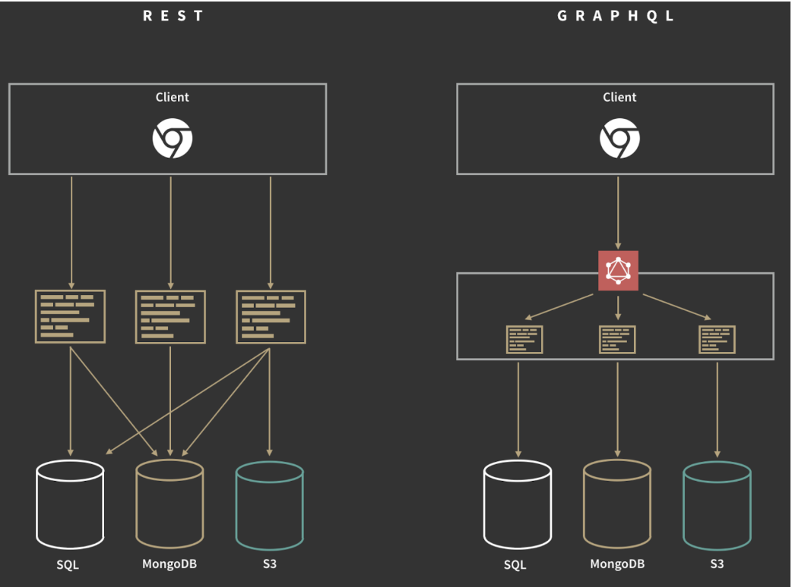
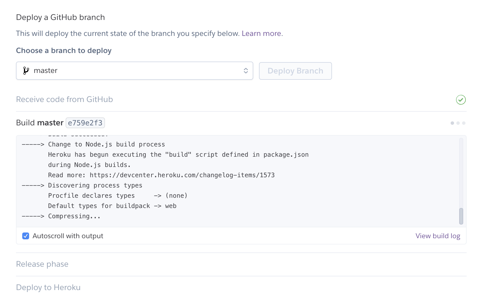
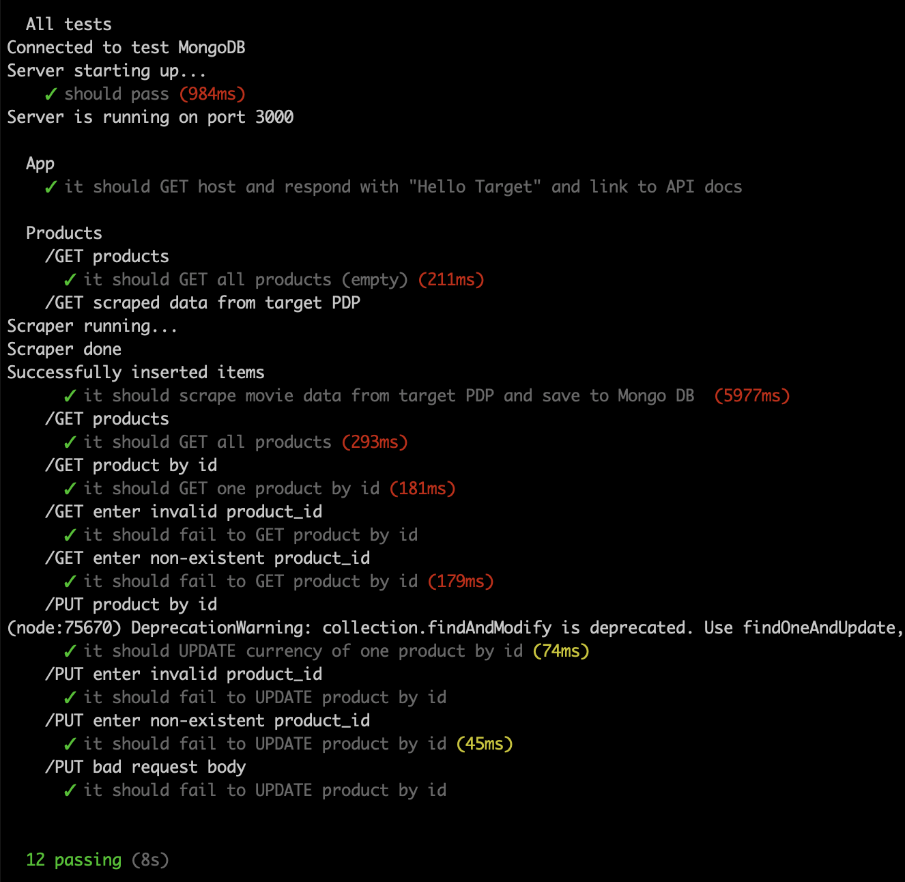

# myRetail 

myRetail is a rapidly growing company with HQ in Richmond, VA and over 200 stores across the east coast. myRetail wants to make its internal data available to any number of client devices, from myRetail.com to native mobile apps.

The goal for this exercise is to create an end-to-end Proof-of-Concept for a products API, which will aggregate product data from multiple sources and return it as JSON to the caller.

Your goal is to create a RESTful service that can retrieve product and price details by ID. The URL structure is up to you to define, but try to follow some sort of logical convention.

# Breaking it down

## Step 1: Think broadly about the problem space and business needs

- Observation: "myRetail has HQ and 200 stores on the east coast, but is growing fast" 
    - What is myRetail's rate of growth (how many new stores per month)? 
    - Look at past 8 quarters of metrics (sales volume, transaction count, customer count, traffic trends, etc) 
    - Understand plans for expansion (US and OUS)  
    - Understand competitive landscape, how are direct competitors investing in apps/services/data 
    - Understand current growth initiatives and any operational challenges hindering growth   

- Observation: "myRetail wants to make its internal data available" 
    - Public API or restricted? 
    - Describe the nature of internal data to be made accessible 
    - Understand the data sources: Type of storage infrastructure, where is it located, how it is maintained and by whom, DB technologies used, optimized for performance, scalability and high availability? 
    - Privacy assessment? How is the data classified and what is the risk PII exposure/misuse? 
    - Understand security architecture and myRetail compliance requirements
    - Understand data management, flows, permissions model and how other systems interop today 
    - Rate of new products being added/updated? 
    - Plans for dynamic pricing strategies across region/store/user

- Observation: “any number of client devices" 
    - What are the common data usage patterns across client apps? 
    - Data priority, what fields are most important and why? 
    - How is language localization being handled?
    - Options for optimizing payload, response times, etc
    - Plans for API consumption tracking/metering 
    - Documentation, code samples, error handling, version management?
  

## Step 2: Before diving in, do some quick reading to learn from others

### Innovation in dynamic pricing and AI-based price optimization 

"Pricing is becoming intelligent and continually adjusting to changing consumer behaviour and demand preferences, while also responding to organisational inventory and marketing requirements as well as other external pricing influences."

- https://medium.com/@RemiStudios/artificial-intelligence-for-dynamic-pricing-326c3b88a37
- https://tryolabs.com/blog/price-optimization-machine-learning/
- http://blmm-conference.com/wp-content/uploads/blimm1608.pdf

Retailers use Machine learning techniques to optimize product pricing.  Predictive models are helping retailers A) understand how customers will react to different pricing and B) develop pricing strategies that align with overall company objectives. As myRetail scales, the company should consider capabilities that strengthen pricing strategies across all stores and digital properties.

### REST or GraphQL? 

Though it's early days for GraphQL, I see big benefits like: server driven, less chatty, more client friendly than traditional REST.  However, GQL is a bit immature.  I would encourage exploration and keeping an eye on it, but don’t think it’s the right thing for myRetail right now as they scale. https://www.moesif.com/blog/technical/graphql/REST-vs-GraphQL-APIs-the-good-the-bad-the-ugly/#

**Rationale:** 

- GQL design doesn’t encourage shared-nothing architecture 
- GQL has its own syntax that could make aggregation queries harder to model 
- Love the idea of single endpoint and dropping API versioning in the resource path, but it’s harder to establish backwards compatibility and leaves caching up to the developer to implement which is not ideal
- No great options for monitoring :(

### Look at other examples of the myRetail on GitHub
- https://github.com/LBenotsch/myretail-restful-service
- https://libraries.io/github/lenzenc/myretail
- https://github.com/rohitdec01/myRetail
- https://github.com/GauravKarale/myRetail
- https://github.com/shubaajad/myretail
- https://github.com/stevebargelt/myRetail

## Step 3: Build a proof of concept

### Build an application that performs the following actions

- Responds to an HTTP GET request at /products/{id} and delivers product data as JSON (where {id} will be a number.
- Example product IDs: 15117729, 16483589, 16696652, 16752456, 15643793)
- Example response: {"id":13860428,"name":"The Big Lebowski (Blu-ray) (Widescreen)","current_price":{"value": 13.49,"currency_code":"USD"}}
- Performs an HTTP GET to retrieve the product name from an external API. (For this exercise the data will come from redsky.target.com, but let's just pretend this is an internal resource hosted by myRetail)

- Example: <http://redsky.target.com/v2/pdp/tcin/13860428?excludes=taxonomy,price,promotion,bulk_ship,rating_and_review_reviews,rating_and_review_statistics,question_answer_statistics>
- Reads pricing information from a NoSQL data store and combines it with the product id and name from the HTTP request into a single response.
- BONUS: Accepts an HTTP PUT request at the same path (/products/{id}), containing a JSON request body similar to the GET response, and updates the product's price in the data store.

### My PoC

*Tech*
- Node/Express/Mocha/Chai
- MongoDB Atlas (hosted)
- Swagger docs

To run locally,

**Prerequisites**
- node 9.5.x
- npm 6.4.x
- MongoDB Atlas connection string 

**Download & Install**
~~~~
git clone https://github.com/zRealMikeJordan/myRetailRESTfulService.git
cd myRetailRESTfulService
npm install
~~~~

**Create .env file in root and populate environment variables**
NOTE: Connection string for prod mongo and test mongo are both required
~~~~
MONGO_HOST={{MONGO_CONNECTION_STRING_FOR_YOUR_PRODUCTION_DB}}
MONGO_HOST_TEST={{MONGO_CONNECTION_STRING_FOR_YOUR_TEST_DB}}
TARGET_PDP_SCRAPE_TEST_URL=https://www.target.com/p/shawshank-redemption-special-edition-dvd/-/A-11625643
REDSKY_URL=http://redsky.target.com/v2/pdp/tcin
API_HOST=http://localhost
PORT=3000
~~~~

**Run tests**
Test all routes and data scraping from Target.com 
~~~~
npm run test
~~~~

**Run dev**
Connects to dev database
~~~~
npm run dev
~~~~

**Run prod**
Connects to prod database
~~~~
npm run start
~~~~

**Open app**
~~~~
http://localhost:3000
~~~~

## Step 4: Recommendations for use in a production environment

- Highest recommendation: spend time understanding the business needs and contraints before racing to production.  Align with business partners on an implementation strategy that can scale with rest of the business and evolve to meet changing needs.
- Leverage caching to promote fast response times
- Improve tests and increase code coverage
- Set up API gateway for documentation, traffic management, logging, auth, etc 
- Require client applications to have a proper token to access resources
- Use mongoDB cluster with continuous backups
- Connect to a build pipeline, spin up ephemeral environments that run automated tests and promote to staging/prod
- Deploy to load balanced production environment that can scale up and down based on demand

